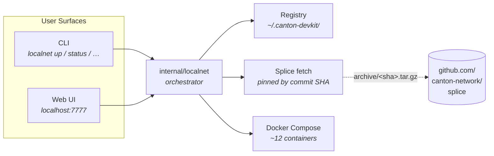

<div align="center">

<a href="https://github.com/bitdynamics-ab/canton-devkit">
  <picture>
    <source media="(prefers-color-scheme: dark)" srcset="docs/design/mockups/assets/bitdynamics-mark.svg" />
    
  </picture>
</a>

# canton-devkit

### The fastest way to run a [Canton](https://canton.network/) network on your laptop.

A single-binary toolkit for spinning up, inspecting, and tearing down a complete Canton developer stack — Canton synchronizer + participant, Splice super-validator apps, three party wallets (app-user, app-provider, SV), Scan explorer, signed JWTs — in **one command**.

<p>
  <a href="https://github.com/bitdynamics-ab/canton-devkit/actions/workflows/ci.yml"></a>
  <a href="https://pkg.go.dev/github.com/bitdynamics-ab/canton-devkit"></a>
  <a href="https://github.com/bitdynamics-ab/canton-devkit/releases/latest"></a>
  <a href="LICENSE"></a>
</p>

<p>
  <a href="#-quickstart"><b>Quickstart</b></a> ·
  <a href="#-web-ui"><b>Web UI</b></a> ·
  <a href="#-commands"><b>Commands</b></a> ·
  <a href="#-architecture"><b>Architecture</b></a> ·
  <a href="#-faq"><b>FAQ</b></a> ·
  <a href="#%EF%B8%8F-roadmap"><b>Roadmap</b></a>
</p>

<table align="center"><tr><td>

```sh
❯ canton-devkit localnet up demo
  ✓  Splice 0.6.4 cache hit
  ✓  Compose started · 12 containers
  ✓  Health checks · canton · splice · postgres
  ✓  JWTs signed · app-user · app-provider · super-validator
  ✦  "demo" is ready · Splice 0.6.4 · ready in 1m 24s
```

</td></tr></table>

</div>

---

## ✨ Why canton-devkit?

[Canton](https://canton.network/) is the public blockchain with built-in privacy, designed for regulated finance — but its local-dev story has historically been a multi-hour expedition: clone [Splice](https://github.com/canton-network/splice), decode docker-compose layers, hunt JWT secrets, copy-paste party IDs. `canton-devkit` collapses that into a single binary built around three convictions:

<table>
<tr>
  <td width="33%" valign="top">

### ⚡ One command
No YAML editing, no env-file shuffling. `up` downloads Splice, signs JWTs, brings up a dozen containers, prints endpoints. Cold start **~90 s**.

  </td>
  <td width="33%" valign="top">

### 🌐 Two surfaces
Same code, two skins: a polished CLI for terminals & CI, a real Vite/React Web UI for browser-driven inspection. **Always at parity.**

  </td>
  <td width="34%" valign="top">

### 🔐 Zero lock-in
No forks, no patches. Thin wrapper over upstream [Splice LocalNet](https://github.com/canton-network/splice), pinned to **immutable commit SHAs** and verified by content hash.

  </td>
</tr>
<tr>
  <td valign="top">

### 🧪 Snapshot & restore
Save a working state to a `.tgz`, hand it to a teammate, replay it on CI. **Disaster recovery in 4 seconds.**

  </td>
  <td valign="top">

### 📦 Single binary
`go install` or `dpm install package` — same artefact. macOS arm64, Linux amd64, Windows amd64. **No JVM, no Python, no Node** at runtime.

  </td>
  <td valign="top">

### 🔭 Observability built-in
Optional `--profile observability` adds **Prometheus + Grafana** with a curated Canton dashboard. CLI scrapes the same metrics.

  </td>
</tr>
</table>

---

## 🎯 Who is this for?

| You are… | We've got you because… |
|---|---|
| **A Daml/Canton app developer** | Reproducible local stack, signed JWTs, party IDs auto-recorded, hot DAR upload |
| **A CI engineer** | Pinned versions, `--json` everywhere, exit codes documented, snapshot/restore for fixtures |
| **An evaluator** | One command to a healthy network. Tear it down with `clean` when you're done |
| **A workshop facilitator** | Same demo on every laptop, regardless of OS or Apple Silicon |

> [!NOTE]
> **Not for production.** This is a developer tool. For production Canton deployments, see the official [Canton documentation](https://docs.daml.com/canton/).

---

## 🚀 Quickstart

> 📖 Full walkthrough — DPM + standalone install on macOS/Linux/Windows,
> Docker prerequisites, compatibility matrix, troubleshooting, and a
> zero-to-running LocalNet guide — lives in
> [docs/getting-started.md](docs/getting-started.md).
>
> **Docs index:** [Getting started](docs/getting-started.md) ·
> [Tokens (CIP-0112 / V2)](docs/tokens.md) ·
> [Explorer](docs/explorer.md) ·
> [Dashboard customization](docs/dashboard-customization.md) ·
> [FAQ](docs/faq.md) ·
> [Troubleshooting](docs/troubleshooting.md) ·
> [Versions](docs/versions.md) ·
> [Limitations](docs/limitations.md) ·
> [Validation checklist](docs/validation-checklist.md) ·
> [Telemetry](docs/telemetry.md)
>
> Demo: [`scripts/demo.sh`](scripts/demo.sh) (guided tour) ·
> [`scripts/validate-zero-to-localnet.sh`](scripts/validate-zero-to-localnet.sh) (timed M1 check)

### 1 · Install

<details open>
<summary><b>Pre-built binary</b> — pick your OS  (recommended)</summary>

Releases live at [github.com/bitdynamics-ab/canton-devkit/releases](https://github.com/bitdynamics-ab/canton-devkit/releases). Three platforms ship today; for anything else use the *from source* path below. The snippets below pin `v0.7` — substitute the [latest tag](https://github.com/bitdynamics-ab/canton-devkit/releases) as it advances.

**macOS (Apple Silicon)**

```sh
V=v0.7
curl -L -o canton-devkit.tar.gz \
  "https://github.com/bitdynamics-ab/canton-devkit/releases/download/${V}/canton-devkit_${V}_darwin_arm64.tar.gz"
tar -xzf canton-devkit.tar.gz
chmod +x canton-devkit
sudo mv canton-devkit /usr/local/bin/
canton-devkit version
```

**Linux (x86_64)**

```sh
V=v0.7
curl -L -o canton-devkit.tar.gz \
  "https://github.com/bitdynamics-ab/canton-devkit/releases/download/${V}/canton-devkit_${V}_linux_amd64.tar.gz"
tar -xzf canton-devkit.tar.gz
chmod +x canton-devkit
sudo mv canton-devkit /usr/local/bin/
canton-devkit version
```

**Windows (x86_64)** — PowerShell

```powershell
$V = "v0.7"
$dest = "$env:USERPROFILE\bin"
New-Item -ItemType Directory -Force $dest | Out-Null
Invoke-WebRequest `
  -Uri "https://github.com/bitdynamics-ab/canton-devkit/releases/download/$V/canton-devkit_${V}_windows_amd64.zip" `
  -OutFile canton-devkit.zip
Expand-Archive -Force canton-devkit.zip -DestinationPath $dest
# Add %USERPROFILE%\bin to your PATH (one time), then:
canton-devkit version
```

> **Note** — `v0.7` is a pre-release; check the [releases page](https://github.com/bitdynamics-ab/canton-devkit/releases) for the latest tag and substitute `V` in the URLs above. Each release publishes a `SHA256SUMS` file at the same base URL — pair the archive with it to verify the download (the CI examples in [`examples/ci/`](examples/ci/) show the verify pattern). Intel Mac (`darwin_amd64`) and Linux ARM (`linux_arm64`) artefacts are on the roadmap; for now, build from source on those platforms.

</details>

<details>
<summary><b>From source</b> (Go 1.22+, Node 20+)</summary>

```sh
git clone https://github.com/bitdynamics-ab/canton-devkit.git
cd canton-devkit
make build          # → ./bin/canton-devkit
make frontend       # → bakes the Web UI into the binary (optional)
```

</details>

<details>
<summary><b>As a DPM component</b></summary>

```sh
dpm install package canton-devkit
dpm localnet up demo
```

`dpm localnet …` and `canton-devkit localnet …` are the same binary; pick whichever your team uses.

</details>

### 2 · Run

```sh
# Verify your host is ready (Docker, RAM, disk, ports)
canton-devkit localnet doctor

# Bring up a Canton network called "demo"
canton-devkit localnet up demo

# Inspect from the browser
canton-devkit localnet ui

# …or stay in the terminal
canton-devkit localnet status              # ports, health, uptime
canton-devkit localnet logs canton         # tail Canton's logs
eval "$(canton-devkit localnet env)"       # export endpoints to your shell

# Snapshot, tear down, restore
canton-devkit localnet snapshot --to demo.tgz
canton-devkit localnet clean
canton-devkit localnet restore --from demo.tgz
```

> [!TIP]
> Stuck? Run `canton-devkit localnet doctor` — it tells you exactly what's missing and how to fix it.

---

## 🖥️ Web UI

`canton-devkit localnet ui` launches a polished Vite/React dashboard, embedded in the binary, **loopback-only by default**.

<table>
<tr>
  <td valign="top" width="50%">

**What you get**

- 📊 **Live overview** — instance status, container health (SSE)
- 🔑 **Developer setup** — copy JWTs, export `.env` / `.json` / `.yaml`
- 💾 **Backup & restore** — download a snapshot, drag-drop to restore
- 🪵 **Per-container logs** — `docker logs --tail` in the browser
- ⚡ **<kbd>⌘ K</kbd> palette** — fuzzy-jump between instances and routes
- 🩺 **Live preflight** — Docker, memory, disk, before every `up`

  </td>
  <td valign="top" width="50%">

**Security model**

- Bound to `127.0.0.1` — refuses non-loopback hosts unless `--allow-non-loopback`
- CSRF: same-Origin gate on all state-changing requests
- JWTs redacted by default in responses; opt-in via explicit query flag
- Embedded SPA — no external CDN, no analytics, no phone-home

For remote access:

```sh
ssh -L 7777:127.0.0.1:7777 dev-host
```

  </td>
</tr>
</table>

---

## 📚 Commands

The CLI is organised under `localnet`:

| Lifecycle | Inspect | Data | Diagnostics |
|---|---|---|---|
| `up` (or `start`) — start instance | `status` — health + ports | `snapshot` — tar volumes + state | `doctor` — host preflight |
| `down` (or `stop`) — stop containers | `list` — registered instances | `restore` — recreate from tar | `logs` — tail any container |
| `restart` — down + up | `env` — shell exports | `refresh` — re-sync from docker | `metrics` — Prometheus scrape |
| `clean` — wipe everything | `versions` — supported Splice tags | `dar upload`/`dar list` — Daml archives | `container <verb>` — per-container ops |
| `ui` — launch Web UI | `contracts watch` — live ACS | `tx ls` / `tx replay` — ledger queries |  |

Every command supports `--help`. The output-oriented commands (`up`, `status`, `list`, `env`) also support `--json` for machine-readable output. Run `canton-devkit localnet <command> --help`.

---

## ⚙️ Configuration

Defaults are tuned for "just works"; configuration is opt-in.

| Flag / env | Default | Purpose |
|---|---|---|
| `<name>` or `--name <name>` | required | Instance label + Docker compose project prefix |
| `--version <tag>` | `latest` | Splice version (see [`versions`](docs/versions.md)) |
| `--profile observability` | off | Add Prometheus + Grafana to the compose stack |
| `--port <n>` (ui) | `7777` | Web UI port |
| `--host <ip>` (ui) | `127.0.0.1` | Bind interface (loopback-enforced) |
| `CANTON_DEVKIT_REGISTRY` | `~/.canton-devkit/localnet` | Instance state directory |
| `NO_COLOR=1` | unset | Disable ANSI colour in CLI |

---

## 🏗️ Architecture



**What `localnet up` actually starts**

A default instance comes up with 12 services on a single Docker Compose network:

| Service | What it is |
|---|---|
| `canton` | A Canton node bundling **participant + synchronizer** (the Canton blockchain itself) |
| `splice` | A single JVM running the [Splice](https://github.com/canton-network/splice) reference apps — **super-validator, validator, ANS (name service), and Scan backends** — for the three party roles |
| `postgres` | Shared database backing the participant and the Splice apps |
| `nginx` | Reverse proxy that fronts the Web UIs and the participant HTTP/JSON Ledger API |
| `wallet-web-ui-{app-user, app-provider, sv}` | Wallet UI per [party role](https://docs.daml.com/concepts/glossary.html#party) |
| `ans-web-ui-{app-user, app-provider}` | Canton Name Service UI per party |
| `scan-web-ui` | Block explorer for the local Canton network |
| `sv-web-ui` | Super-validator operator console |
| `swagger-ui` | OpenAPI explorer for the Splice and Ledger APIs |

The `splice` container runs **one Java process** (`SpliceApp daemon`) that hosts the super-validator + validator + ANS + Scan apps internally; the three party UIs are separate static-served bundles. Confirmed against an actual `localnet up` (`docker compose ps`).

**Design notes**

| | |
|---|---|
| **Splice integration** | We download `cluster/compose/localnet/` from upstream [`canton-network/splice`](https://github.com/canton-network/splice) — described by the project as *"reference applications for operating Validators and Super-Validators on the Canton Network"* — pinned by commit SHA (immutable) and verified by SHA-256 post-extract. No forks, no patches. Maintainer flow: [`docs/versions.md`](docs/versions.md) |
| **Registry** | Every instance has a `state.json` (ports, JWTs, party IDs, compose project name). Single source of truth for CLI + Web UI. Atomic writes + index lock for concurrent ups |
| **JWT signing** | Splice LocalNet authenticates ledger and app traffic with a **fixed dev secret** — the literal string `unsafe` — applied to HS-256 JWTs (Splice config labels: `unsafe-jwt-hmac-256` / `hs-256-unsafe`). The DevKit signs JWTs locally with that same secret so client code can `Bearer <token>` against the local participant. **Never reuse against MainNet or any non-LocalNet deployment** — warning reprinted on every signing path |
| **CLI ↔ Web UI parity** | Every user-facing operation lands on both surfaces. Codified in [`AGENTS.md`](AGENTS.md). No UI-only or CLI-only features |

---

## 🗺️ Roadmap

| Milestone | Status | Highlights |
|---|---|---|
| **M1 — LocalNet CLI** | ✅ Shipped | `up` / `down` / `status` / `list` / `logs` / `env` / `doctor` / `snapshot` / `restore` + friendly errors |
| **M2 — Web UI + Observability + DAR + Agent skills** | 🚧 In progress | Dashboard, container health, JWT issuer, app-config exporter, snapshot/restore UI |
| **M3 — Canton Token Standard** | 📅 Planned | `token create` / `mint` / `transfer` / `balance` — CLI + Web UI. Tracks [CIP-0056](https://github.com/canton-foundation/cips/blob/main/cip-0056/cip-0056.md) (finalised) and incorporates [CIP-0112](https://github.com/canton-foundation/cips) (V2 draft — privacy, performance, accounting improvements) as it stabilises |

Follow progress in [open PRs](https://github.com/bitdynamics-ab/canton-devkit/pulls), or [open an issue](https://github.com/bitdynamics-ab/canton-devkit/issues/new) to weigh in on direction.

---

## ❓ FAQ

<details>
<summary><b>Is this an official Canton or Digital Asset project?</b></summary>

No. It's a community tool built by [Bit Dynamics AB](https://bitdynamics.me/) under a [Canton Foundation grant](https://github.com/canton-foundation/canton-dev-fund/pull/18). The upstream Splice repo it wraps is governed by the [Canton Network](https://canton.network/).
</details>

<details>
<summary><b>How is this different from <code>cn-quickstart</code>?</b></summary>

[cn-quickstart](https://github.com/digital-asset/cn-quickstart) is an app-provider scaffold: it layers a backend service, Daml workflows, and a sample frontend on top of Splice LocalNet. `canton-devkit` is the LocalNet layer underneath. They're complementary — point `cn-quickstart` at a LocalNet brought up by `canton-devkit`.
</details>

<details>
<summary><b>Can I run multiple instances in parallel?</b></summary>

Yes. Each instance has its own Docker compose project, network, port range, and registry entry. `localnet list` shows them all; `localnet ui` shows them in a switcher.
</details>

<details>
<summary><b>Where are the JWTs? Are they secure?</b></summary>

`canton-devkit localnet env <name> --include-jwt` prints them. By default they're redacted in any UI/CLI output (opt-in via the flag). The dev-secret warning is reprinted on every signing path. **Never reuse these tokens against MainNet** — they're for local dev only.
</details>

<details>
<summary><b>My <code>localnet up</code> fails with <code>PORTS_IN_USE</code>.</b></summary>

Another instance is using the default port range. Two ways to recover:

1. **Stop the conflicting instance** — `localnet list` shows everything registered; `localnet down <conflicting>` frees the ports.
2. **Run a fresh instance under a different name** — each name gets its own port window allocated automatically. `localnet up demo-2` will pick the next free range.

Use `localnet doctor` to see exactly which ports are in use before retrying.
</details>

<details>
<summary><b>I'm on Apple Silicon (M1/M2/M3). Anything special?</b></summary>

Yes, this works. The Splice container images published under `ghcr.io/digital-asset/decentralized-canton-sync/docker/*` are multi-arch (verified via `docker manifest inspect` against the `0.6.4` tag — Canton, Splice, and the wallet/scan UIs all carry `linux/arm64` manifests). The DevKit binary itself ships as native arm64. Expect ~3-5 min cold start vs ~1-2 min on x86_64 Linux.
</details>

<details>
<summary><b>How do I integrate with CI?</b></summary>

```yaml
- name: Bring up Canton LocalNet
  run: |
    canton-devkit localnet up ci --json > /tmp/instance.json
    eval "$(canton-devkit localnet env ci --include-jwt)"

- name: Run integration tests
  run: npm test

- name: Tear down
  if: always()
  run: canton-devkit localnet clean --name ci
```

For fixtures, snapshot once and check in the `.tgz` (or stash on object storage); subsequent runs restore in 4 seconds.
</details>

<details>
<summary><b>Where does state live? Can I wipe it?</b></summary>

`~/.canton-devkit/localnet/<name>/state.json` per instance, plus an `index.json`. Docker volumes are named `canton-<name>_<vol>`. `localnet clean --name <name>` removes both. To nuke everything: `rm -rf ~/.canton-devkit && docker compose ls -aq | xargs -I {} docker compose -p {} down -v`.
</details>

---

## 💬 Get help

| Question | Where to ask |
|---|---|
| **"I think this is a bug"** or **"How do I…?"** | [Open an issue](https://github.com/bitdynamics-ab/canton-devkit/issues/new) — we triage usage questions and bugs together |
| **Canton / Daml questions** | [Canton forum](https://forum.canton.network/) (formerly `discuss.daml.com`) — better answers there than from us |

---

## 🤝 Contributing

Contributions welcome — see [`AGENTS.md`](AGENTS.md) for the full set of conventions.

**Quick rules**

- ✅ All tests pass — `make test` + `cd frontend && npm test`
- ✅ **CLI ↔ Web UI parity** — every user-facing change lands on both surfaces
- ✅ One logical change per PR
- ✅ Stable error codes — `INSTANCE_NOT_FOUND`, `PORTS_IN_USE`, etc.; never renamed once shipped

```sh
make build              # build the binary
make test               # run Go tests
make lint               # golangci-lint
make frontend           # build the Web UI bundle
make frontend-test      # run Web UI tests
uvx pre-commit install  # install Git hooks (requires uv)
```

Open an [issue](https://github.com/bitdynamics-ab/canton-devkit/issues) first for anything non-trivial. PRs against `main` welcomed.

---

## 📦 Releasing

Tagged builds (`v*`) publish:

- Linux + macOS + Windows binaries to [GitHub Releases](https://github.com/bitdynamics-ab/canton-devkit/releases)
- DPM component to `ghcr.io/bitdynamics-ab/homebrew-canton-devkit:<tag>`

Manual cut: `git tag v0.1.0 && git push origin v0.1.0`. The [release workflow](.github/workflows/release.yml) handles the rest.

---

## 💛 Acknowledgements

`canton-devkit` wraps the [Splice LocalNet](https://github.com/canton-network/splice) compose project published by the Canton Network community. Splice is [Digital Asset](https://www.digitalasset.com/)'s open-source reference implementation of the Canton Network validator and super-validator apps. The Global Synchronizer that underpins Canton Network is governed by the [Canton Foundation](https://canton.foundation/), which also funds this project via a [developer grant](https://github.com/canton-foundation/canton-dev-fund/pull/18). Daml — the smart-contract language Canton uses — is developed by Digital Asset.

<div align="center">

<sub>
Built with care by <a href="https://bitdynamics.me/">Bit Dynamics AB</a> · Licensed <a href="LICENSE">Apache 2.0</a> · <a href="https://github.com/bitdynamics-ab/canton-devkit/stargazers">⭐ Star us</a>
</sub>

</div>
